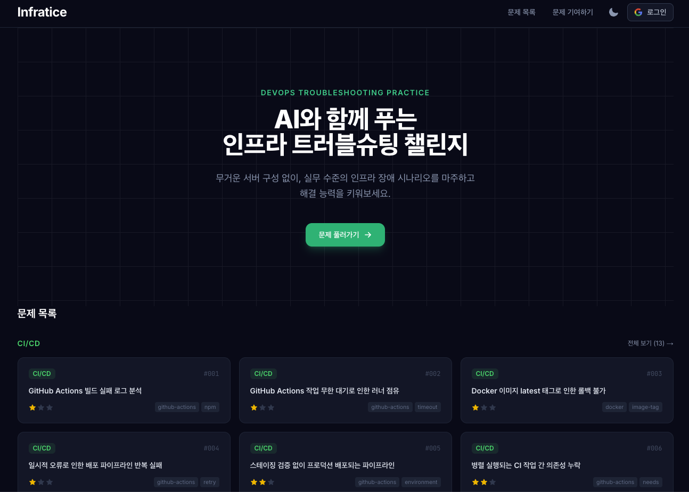

# Infratice

인프라 운영 중 실제로 마주칠 수 있는 장애 상황을 글과 로그, 설정 파일 형태로 풀어보는 트러블슈팅 연습용 프로젝트입니다.

[infratice.co.kr](https://infratice.co.kr)

<div align="center">
  
</div>

---

## 프로젝트 소개

인프라나 DevOps를 공부할 때는 개념 자료는 많지만, 장애 상황을 직접 읽고 원인을 추론해보는 연습은 상대적으로 어렵습니다.

`Infratice`는 이런 점을 보완하기 위해 만든 문제 기반 학습 프로젝트입니다. 사용자는 주어진 로그와 설정 파일을 읽고 원인을 정리한 뒤, 자신의 방식으로 해결 과정을 기록할 수 있습니다.

환경을 직접 띄우는 대신 문제에 필요한 자료를 정적으로 제공하는 형태라서, 빠르게 여러 시나리오를 살펴보기에 적합합니다.

---

## 제공하는 내용

### 장애 시나리오
Linux, Kubernetes, Network, CI/CD, Monitoring 등 여러 주제의 문제를 다룹니다.

### 로그와 설정 파일
문제를 푸는 데 필요한 로그, 설정 파일, 상태 정보 등을 화면에서 바로 확인할 수 있습니다.

### 풀이 노트 작성
원인 추론과 해결 방법을 마크다운 형태로 정리할 수 있습니다.

### AI 검토용 프롬프트 생성
작성한 풀이와 문제 데이터를 바탕으로 AI에게 검토를 요청할 수 있는 프롬프트를 만들어 복사할 수 있습니다.

### 모범 답안 확인
풀이 후에는 출제 의도와 함께 권장하는 분석 흐름, 해결 방법을 확인할 수 있습니다.

---

## 기술 스택

| 영역 | 기술 |
|---|---|
| 프레임워크 | Next.js (App Router) |
| 언어 | TypeScript |
| 스타일링 | Tailwind CSS v4 |
| 코드 하이라이팅 | Shiki |
| 콘텐츠 관리 | Markdown 파일 기반 |
| 배포 | Cloudflare Pages |

---

## 로컬 실행

**요구사항:** Node.js 18+, pnpm

```bash
git clone https://github.com/your-org/infratice.git
cd infratice
pnpm install
pnpm dev
```

브라우저에서 `http://localhost:3000`으로 접속하면 됩니다.

| 명령어 | 설명 |
|---|---|
| `pnpm dev` | 개발 서버 실행 |
| `pnpm build` | 프로덕션 빌드 |
| `pnpm start` | 프로덕션 서버 실행 |
| `pnpm lint` | 린트 실행 |

---

## 기여하기

새로운 장애 시나리오나 기존 문제의 개선 제안은 언제든지 환영합니다.

문제를 추가할 때는 `content/problems/TEMPLATE.md`를 복사해 새 파일을 만든 뒤 내용을 작성하면 됩니다.

```bash
cp content/problems/TEMPLATE.md content/problems/{카테고리}/{NNN}-{설명}.md
```

작성 규칙과 체크리스트는 [`CONTRIBUTING.md`](./CONTRIBUTING.md)를 참고해 주세요.

---

## License

This project is licensed under the MIT License. See the [LICENSE](LICENSE) file for details.
